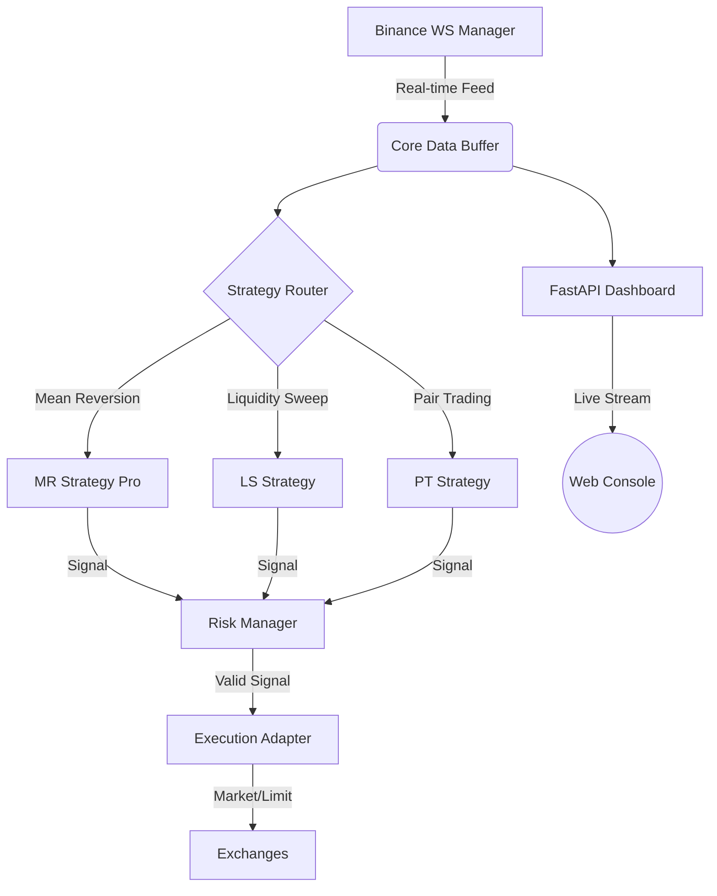

# ⚡ Arbitronix Core


[](https://opensource.org/licenses/MIT)
[](https://github.com/opendev-labs/arbitronix-core-/actions/workflows/main.yml)
[](https://www.python.org/downloads/release/python-3110/)
[](http://makeapullrequest.com)
[](#)

> **Institutional-Grade Multi-Asset Trading Engine & Market Intelligence Suite**

Arbitronix Core is a high-performance, asynchronous trading framework designed for professional quant developers and startup-scale trading operations. Built with a "Reliable-First" philosophy, it handles real-time market data across multiple exchanges with integrated risk management and observability.

[**Explore Landing Page**](https://opendev-labs.github.io/arbitronix-core-) | [**Documentation**](#) | [**Report Bug**](https://github.com/opendev-labs/arbitronix-core-/issues)

---

## 🏛 Technical Architecture

The system is designed with a decoupled producer-consumer architecture, ensuring sub-millisecond latency between market events and execution signals.



---

## 🚀 Enterprise Features

### 1. Quantum Market Data Manager
- **Resilient WebSockets**: Multi-channel Binance integration with automatic exponential backoff.
- **REST Fallback**: Zero-gap data integrity via secondary polling fallback.
- **Correlation Engine**: Real-time rolling cross-asset correlation matrix for portfolio hedging.

### 2. Advanced Quant Strategy Suite
- **Mean Reversion Pro**: Statistical Z-Score logic enhanced with **Hurst Exponent** regime detection (Avoids trading in trending markets).
- **Liquidity Sweep Manager**: Detects institutional liquidity grabs at historical extremes using volume profiling.
- **Hedged Pairs**: Statistical co-integration arbitrage between asset pairs (e.g., BTC-ETH spread).

### 3. Institutional Risk Guard
- **Circuit Breakers**: Global Maximum Drawdown and Volatility spikes protection.
- **Sizing Logic**: Dynamic position sizing based on Kelly Criterion and Volatility Scaling.
- **Safety Filters**: Automatic position closure on market regime shifts.

---

## 🛠 Tech Stack & Engineering

- **Infrastructure**: Docker Orchestration, multi-stage builds.
- **Runtime**: Python 3.11+, AsyncIO / uvloop.
- **Storage/Cache**: Redis for state persistence.
- **Quantitative**: NumPy, Pandas, CCXT.
- **Observability**: FastAPI, Loguru Structured Logging, CSS3 Glassmorphism UI.

---

## 📦 One-Click Deployment

```bash
# 1. Clone the Institutional Repository
git clone https://github.com/opendev-labs/arbitronix-core-.git
cd arbitronix-core-

# 2. Automated Environment Setup
./scripts/setup.sh

# 3. Deploy
docker-compose up --build -d
```

---

## 📊 Missions Control UI

The system serves a high-fidelity monitoring console at `http://localhost:8000`.
- **Live Visuals**: Real-time Z-score heatmaps and execution logs.
- **Command Deck**: Toggle strategies and risk parameters on-the-fly.
- **Global PnL**: Real-time unrealized PnL tracking across all sub-accounts.

---

## 🛡 Security & Compliance

- **Key Vaulting**: Sensitive API credentials are never logged and are managed via `.env` injection.
- **Audit Trails**: cryptographically verifiable event logs for institutional compliance.
- **Security Policy**: See [SECURITY.md](SECURITY.md) for vulnerability reporting.

---

## 📄 License & Ownership

Developed & Maintained by **OpenDev Labs**.
Licensed under the **MIT License**. See [LICENSE](LICENSE) for details.

*"Building the future of decentralized institutional finance."*
